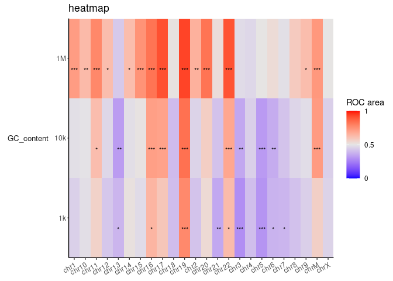

<!-- README.md is generated from README.Rmd. Please edit that file -->

# GenomicHeatMap

<!-- badges: start -->

[](https://github.com/Adrian-Cantu/GenomicHeatMap/actions)
<!-- badges: end -->

GenomicHeatMap is used to generate genomics and epigeniomic heatmaps
from insertion sites

## Installation

You can install the development version of GenomicHeatMap from
[GitHub](https://github.com/) with:

``` r
# install.packages("devtools")
devtools::install_github("Adrian-Cantu/GenomicHeatMap")
```

## Example

This should work out of the box:

``` r
library(GenomicHeatMap)
library(GenomeInfoDb)
intsite_to_heatmap_df(sample_intSites) %>%
  epi_annotate_df() %>%
  make_roc() %>%
  make_heatmap(title='nice heatmap')
```


